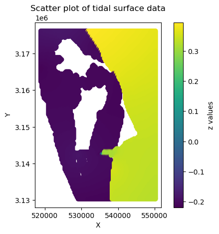

# Method

## Create a tidal surface with [get_tidal_surface.py](get_tidal_surface.py) 

1. Following the method from NOAA SLR viewer, take the DEM, make a mask of zeros matching the DEM at 100m gridding. The closergridding was chosen in order to obtain reasonable results along the coastal edge of Merritt Island, where the majority of itis considered non-tidal but a small sliver of open coastline (covering New Smyrna beach) is valid.
2. Run through vDatum to convert 0 mMHHW to NAVD88 throughout the entire region. For this particular region, which is backedby a non-tidal lagoon, values range from -0.21m to 0.39m. The vertical uncertainty in the tidal models employed by vdatum ofboth the coastal and lagoon areas is similar, roughly 9 cm. 

Result of vDatum. Z values are in mNAVD88, with the tidal surface in MHHW.
    
3. TRIED THIS, DIDN’t WORK Great: 
Linearly interpolate the blank areas. The linear interpolation is a 1st order trend from non-tidal to tidal areas, and is anassumed valid landward extent for a “more generalized surface” by NOAA SLR viewer. 
    

Note that this creates some funky striations near the cape area (y=3.16e6m)
    
4. Linear interpolation was not adequate for the cape area and the water surrounding the KSC launch pad. Instead, ##GO THROUGHCOMPUTER AT WORK FOR METHOD, I DID NOT SAVE IT!!!###
5. Smooth the surface with a Gaussian filter of 150m to remove any abrupt transition from  non-tidal to tidal. The scale is chosen to avoid excess smoothing at Port Canaveral whilst still removing the striations in the Cape region.

Made some small adjustments to how the tidal surface is constructed, but ensuring that the cape area had a smooth transition to non-tidal that more clearly defined the tip.

## Create Bathtub flooding maps

### Create bathtub flooding maps for every cm threshold above MHHW from -100 to 380cm, using the code [get_mask.py](get_mask.py)

1. Elevations (in MHHW datum now) are rounded to the nearest cm, and a binary mask is created for all elevations above/below agiven threshold. This mask is dilated by 1 pixel (3m) in all directions. 
2. Connected areas are labeled using this dilated mask, with all ocean-connected points labeled 3, all inland-connected pointslabeled 2, and all low-lying but disconnected points are labeled as 1. All other points are labeled 0, and are either too high to flood or not covered by the tidal surface.
3. Each flood map is stored in ./connected_masks/mask_combined_{threshold:.2f}mMHHW.nc

This is squished but gets the point across I hope. Dark blue: land surface, blue: disconnected, green: lagoon connected,yellow: ocean connected.

## Process the input probability data    
Two tide gauges are used to determine flood frequency. One at Haulover Canal (North of Merritt Island), the other at Trident Pier (near Port Canaveral). The flooding days statistics are calculated in NAVD datum and then re-mapped to MHHW at each location, with MHHW at Haulover Canal at -0.2mNAVD and Trident Pier at 0.336mNAVD. The data from Phil is relative to 100cm *below* NAVD, so here is a script to read it all in, and adjust things to MHHW: [rename_inputData.py](rename_inputData.py)

## Create flood raster maps 
### Code: [get_flood_raster_KSC_2gauge.py](get_flood_raster_KSC_2gauge.py)

For each year and scenario, the flooding days frequencies from each gauge are mapped to their respective connected regions at each elevation. In equation terms,

$$ F(y, s, r, e) = f(g, y, s) \quad \text{for } g \in G \text{ where } r(g, e) = r $$

where F is the flooding frequency for a region based on Phil’s analysis and:
- $Y$: Set of years : (2020-2100).
- $S$: Set of scenarios :(int, int-low, int-high, low, high).
- $G$: Set of gauges : (Haulover, Trident)
- $E$: Set of thresholds above MHHW : (-1.00-3.79m)
- $R$: Set of regions : (coastal, inland, disconnected low-lying)
- $f(g,y,s)$: Flooding days frequency observed at gauge $g$ in year $y$ under scenario $s$.
- $r(g,e)$: Region connected to gauge g at threshold elevation $e$.

Now, we need an equation that maps the flooding frequency from each gauge to its respective region for each year, scenario, and threshold elevation. We can define this mapping with a function F that gives the flooding frequency for a region based on the gauge readings:

Note this equation assumes that for each r and e, there is only one gauge that satisfies $r(g,e) = r$, so the mapping is direct and unique. Note that there are a couple of outliers:

- If a region is not in the set $R$, we do not assign a frequency.
- If something is classified as water (-99) or NaN (-999999) in the original DEM, it retains that number classification.
