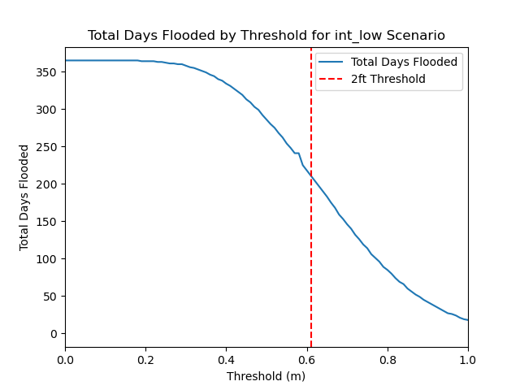
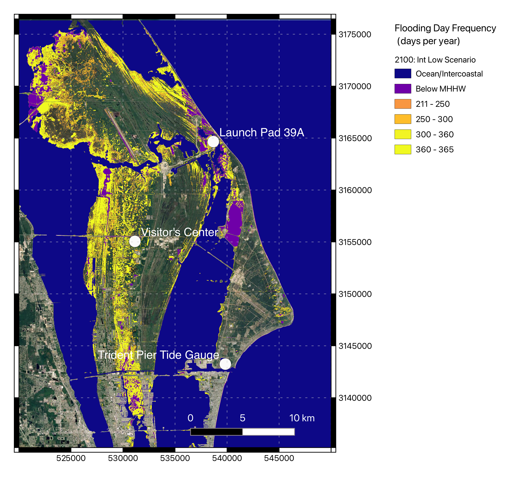

# Mapping Flood Frequency

Major goal: put Phil's flood frequency analysis into space. 
(Launch it to the mooooon!)

We're focusing on Kennedy Space Center for now.

Idea: We have the number of days flooded per year, and we want to map where these thresholds are reached.

Using: [NOAA SLR DEMs](https://coast.noaa.gov/slrdata/), [VDatum](https://vdatum.noaa.gov/welcome.html) (for a tidal surface), and Phil's [tide gauge analysis](https://sealevel.nasa.gov/flooding-analysis-tool/projected-flooding?station-id=8721604&scenario=int-low&threshold=061).

At Kennedy Space Center, that means data from the Trident Pier tide gauge.

Looking at the intermediate-low scenario, we're basically taking this plot:

to this plot:

and turning it into this plot:

